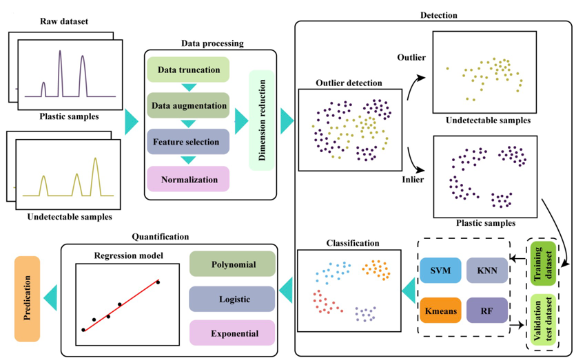

# Nanoplastics-ML
## Introduction
This repository contains the code for the paper "", [ChemRxiv Link]().
This work applies machine learning to forecast types and concentrations of nanoplastics in the environment.
SERS spectrums from a range of plastic and non-plastic samples to build our dataset. This data was then processed and 
cleaned in multiple stages to make it suitable for machine learning. Using the Isolation Forest algorithm, we 
distinguished plastic samples from non-plastic ones. The plastic samples were then further classified using machine 
learning models like K-means, Random Forest, KNN, and SVM. Finally, we predict unseen plastic data using trained models.

The readme file only contains the basic information of this work, please refer to the paper for more details,
 the flowchart of this work is shown below.



## Data
### Brief description
1. Plastic samples: PS, PMMA, PE, PLA
2. Human-biult non-plastic samples
3. mixture plastic samples: PS_PMMA, PS_PE, PS_PLA
4. Unseen plastic samples: PS, PMMA, PE, PLA in tap water,  PS, PMMA, PE, PLA in lake water
The original data is stored in the `original_data` folder for the reference.
### Data category
The data used in this work is divided into several categories, including sample data, regression data and mixture data. 
### Data augmentation
The data augmentation algorithm used in this work is briefly described as follows:
1. The data is divided into several categories.
2. For each category, the data is divided into several groups based on the concentration.
3. For each group, the data is divided into several subsets based on the size.
4. For each subset, the data is augmented by adding noise to the original data.
The algorithm is listed in the folder `src/augumentation`.
The augmented data is stored in the `sample_augumented_data` folder for the reference.
## Methods
### Outlier detection
The outlier detection method we used in this work is isolation forest. By treating all categorized 
data as inliers and undetectable data as outliers, we can train an isolation forest model to detect
the outliers in the data.

### Nano-plastics prediction
Several machine learning algorithms are used in this work to predict the nanoplastics category under different concentrations.
The models used in this work include support vector machine (SVM), random forest (RF), K-nearest neighbors (KNN),
K-means clustering (KMC), and a ensemble model (EM).

## Results
Here is as overview of the results in this work. Please refer to the paper or the `result` folder
for more details.
### Outlier detection

### Nano-plastics prediction
Here is a table to show the prediction results of the models used in this work.


## Implementation
In general, we do not have set up the interface for this work, but you can still refer or use the code in this repository to 
reproduce the results in this work. The required packages are listed in the `requirements.txt` file. You can install
them by using the following command:
```shell
pip install -r requirements.txt
```

[//]: # (You can also run the program with the following command:)

[//]: # (```shell)

[//]: # (python main.py)

[//]: # (```)

[//]: # (The program will take the data from `sample_augumented_data` folder and output the results in the `result` folder.)

[//]: # (You can set your own preferred algorithms for modelling and evaluation.)

## Reproducibility
The results in this work can be reproduced by using the code and model parameters 
stored in the directory `validation/result_reproduce`.
You can run the code with the following command:
```shell
python validation/result_reproduce/main.py
```
Please check more information under this directory.

## Application on unseen data
Meanwhile, we also provide the code for applying the model on unseen data. The code is stored in the directory
`validation/prediction`. You can run the code with the following command:
```shell
python validation/prediction/main.py
```
Please check more information under this directory.

## Acknowledgement

